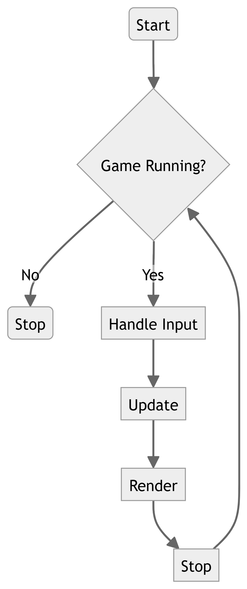

# Sendama Engine &mdash; Documentation

## Table of Contents
- [Introduction](#introduction)
- [Requirements](#requirements)
- [Installation](#installation)
  - [For Linux, BSD etc](#for-linux-bsd-etc)
  - [For Windows](#for-windows)
  - [For OSX](#for-osx)
- [Concept](#concept)
  - [The Game Loop](#the-game-loop)
    - [The Game Class](#the-game-class)
  - [Input](#input)
    - [The Input Class](#the-input-class)
  - [Scenes](#scenes)
    - [Creating a Scene](#creating-a-scene)
    - [Loading a Scene](#loading-a-scene)
    - [Adding a Scene](#adding-a-scene)
    - [Removing a Scene](#removing-a-scene)
  - [Game Objects](#game-objects)
    - [Creating a Game Object](#creating-a-game-object)
    - [Moving a Game Object](#moving-a-game-object)
  - [Components](#components)

## Introduction
Sendama is a 2D game engine for terminal based games. It is written in PHP and is designed to be easy to use and extend. It is a work in progress and is not yet ready for production use.

## Requirements
- PHP 8.3 or newer
- WSL (For Windows)
- Composer 2.7.1 or later

## Installation

### Using the [Sendama CLI](https://github.com/atatusoft-ltd/sendama-console)
The recommended way to install Sendama is through the CLI. You can install Sendama by running the following commands:

```bash
composer global require sendamaphp/console
```

For more information and setup see [Sendama CLI](https://github.com/atatusoft-ltd/sendama-console).

#### Create a new game
Once the CLI is installed, you can start a new game by running the following command:

```bash
sendama new mygame
```

This will create a new game in the current directory. You can get started by changing into the game directory and running the game:

```bash
cd mygame
php mygame.php
``` 

### Using Composer
#### For Linux, BSD etc
```bash
mkdir /path/to/your/game
composer init
...
composer require sendamaphp/engine
```

#### For Windows
From the WSL terminal follow Linux instructions

#### OSX
```bash
mkdir /path/to/your/game
composer init
...
composer require sendamaphp/engine
```

## Concept
Sendama implements a simple game loop that allows you to create games by defining scenes and game objects. Scenes are the main building blocks of a game and are used to group game objects together. Game objects are the entities that make up a game and can be anything from a player character to a wall or a coin.

### The Game Loop
The game loop is the main loop that runs the game. It is responsible for updating the game state and rendering the game to the terminal. The game loop is implemented in the `Game` class. It is started by calling the `run` method on an instance of the `Game` class. There are three stages in the game loop: input, update, and render.



#### The input stage
The input stage is responsible for handling user input. It is implemented in the `InputManager` class. The `InputManager` calls on the `Input` class which provides methods for checking the state of the keyboard and mouse. The `InputManager` class is used by the `Game` class to handle user input.

```php
<?php

function handleInput(): void
{
  InputManager::handleInput();
}
```

#### The update stage
The update stage is responsible for updating the game state. It is implemented in the `Game` class. The `Game` class calls the `update` method on each scene in the game. The `update` method is responsible for updating the game objects in the scene.

```php
<?php

function update(): void
{
    $this->state->update();

    $this->uiManager->update();

    $this->notify(new GameEvent(GameEventType::UPDATE));
}
```

#### The render stage
The render stage is responsible for rendering the game to the terminal. It is implemented in the `Game` class. The `Game` class calls the `render` method on each scene in the game. The `render` method is responsible for rendering the game objects in the scene.

```php
<?php

function render(): void
{
    $this->frameCount++;

    $this->state->render();

    $this->uiManager->render();

    if ($this->getSettings('debug'))
    {
      $this->renderDebugInfo();
    }

    $this->notify(new GameEvent(GameEventType::RENDER));
}
```

### Input
The `Input` class provides methods for checking the state of the keyboard and mouse. It is used by the `InputManager` class to handle user input.

```php

```

### Scenes
Scenes are the main building blocks of a game. They are used to group game objects together. A game can have multiple scenes and each scene can have multiple game objects. Scenes are implemented in the `Scene` class.

#### Creating a Scene
To create a scene you need to create a new instance of the `Scene` class and add it to the game.

```php
use \Sendama\Engine\Core\Scenes\Scene;

...

$scene = new Scene('scene1');

```

#### Loading a Scene
To load a scene you need to call the `loadScene` method on the `SceneManager`.

```php
use \Sendama\Engine\Core\Scenes\SceneManager;

...

SceneManager::getInstance()->loadScene('scene1');
```

Once you have loaded a scene you can add game objects to it. Game objects are the entities that make up a game and can be anything from a player character to a wall or a coin.

```php

```

#### Adding a Scene

```php
use \Sendama\Engine\Core\Scenes\SceneManager;

SceneManager::getInstance()->addScene($scene);
```

#### Removing a Scene