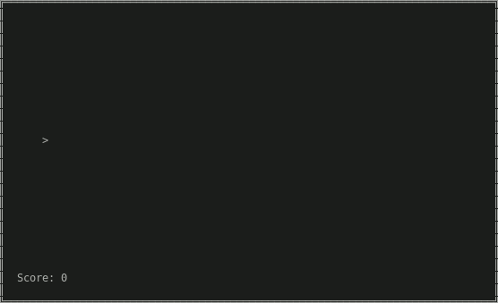
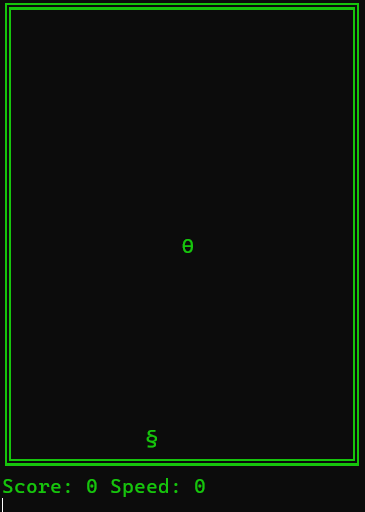
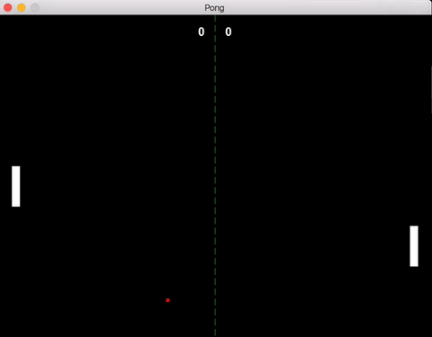

# Sendama Engine &mdash; Example Games

## Table of Contents

- [Introduction](#introduction)
- [Games](#games)
  - [Blasters](#blasters)
  - [Breakout](#breakout)
  - [Snake](#snake)
  - [Pong](#pong)

## Introduction
The examples in this directory are made to demonstrate how Sendama may be used to make simple 2D games.

## Games

### Blasters
A simple game where you control a spaceship and shoot at asteroids.

### Breakout
A simple game where you control a paddle and try to break all the bricks.

### Snake
A simple game where you control a snake and try to eat the food.

### Pong
A simple game where you control a paddle and try to hit the ball past your opponent.

